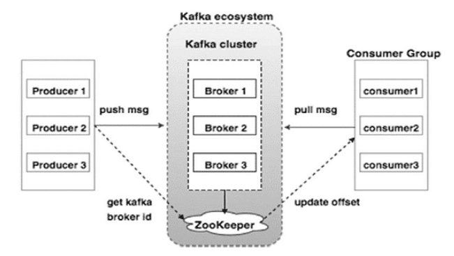

<h1 align="center">
    Kafka Machine
</h1>

<div align="center">


</div>

<br />

Learn how to set up your own kafka cluster on a Virtual Machine
(in this example using Ubuntu OS). But first things first, let's
talk about Kafka.

## Kafka

**Apache Kafka** is a distributed message broker designed to handle 
large volumes of real-time data efficiently. 
Unlike traditional brokers like **ActiveMQ** and **RabbitMQ**, 
Kafka runs as a cluster of one or more servers which makes 
it highly scalable and due to this distributed nature it 
has inbuilt fault-tolerance while delivering higher throughput 
when compared to its counterparts.

This message system comes up with various advanced features 
like built in partition, inherent fault tolerance, 
and replication which make it a good fit for 
large scale message processing business applications. 
Distributed application in the Kafka messaging is 
built on reliable message queuing architecture.

<p align="center">
    
</p>

<br />

## Install

To install kafka on your VM, follow the instructions
in [manual guide](install/README.md).

### Source files

You can download kafka source files from kafka official
archives. Just visit [```kafka archives```](https://kafka.apache.org/downloads).

### Zookeeper

Zookeeper is used by Kafka brokers to determine which 
broker is the leader of a given partition and topic and perform leader elections. Zookeeper stores configurations for topics and permissions. Zookeeper sends notifications to Kafka in case of changes (e.g. new topic, broker dies, broker comes up, delete topics, etc.

### Dashboard

To set a dashboard for our kafka cluster, we are going to
use CMAK. CMAK (previously known as Kafka Manager) 
is a tool for managing Apache Kafka clusters.

Read more about CMAK in this [```repository```](https://github.com/yahoo/CMAK).

### Test kafka machine

We can test our kafka machine by creating a new topic:

```shell
cd /home/kafka/kafka/
bin/kafka-topics.sh --create --zookeeper localhost:2181 --replication-factor 1 --partitions 1 --topic Topic1
```

<br />

## Resources

- [https://kafka.apache.org](https://kafka.apache.org/)
- [https://hevodata.com](https://hevodata.com/blog/how-to-install-kafka-on-ubuntu/)
- [https://cloudinfrastructure.co.uk](https://cloudinfrastructureservices.co.uk/install-apache-kafka-on-ubuntu-20-04-cluster/)